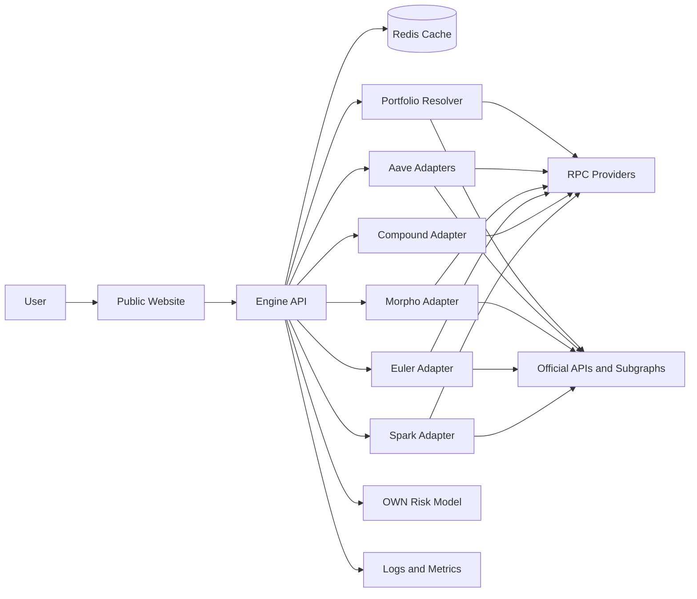
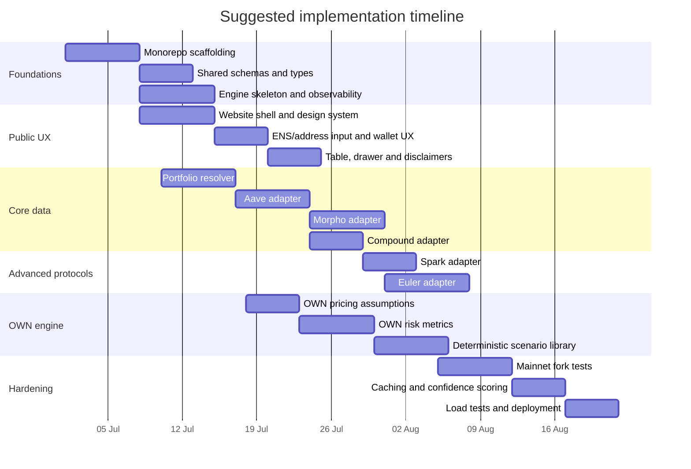

# Monorepo blueprint for a borrowing-capacity comparator and risk engine

## Executive summary

The product should be built as **one monorepo with two independently deployable applications**: a public website that accepts an Ethereum address, ENS name, or wallet connection, and a private backend “engine” that is the sole source of truth for protocol quotes, OWN risk modelling, scenario simulations, and internal credit metrics. That split is not just organisationally cleaner; it is necessary because the protocols you want to compare expose materially different risk models, oracle semantics, and data surfaces. Aave now spans both v3 and a live v4 hub-and-spoke architecture; Morpho Blue is an isolated-market system built around immutable LLTV and per-market oracle choice; Euler V2 is vault- and oracle-modular, including pull-based oracle cases; Compound III uses a single-base-asset Comet model with separate borrow and liquidation collateral factors; SparkLend is Aave-like but uses its own oracle stack and utilities. A frontend should render estimates, but the backend must compute them. citeturn26view2turn19view4turn18view4turn17view4turn17view1turn23view2turn26view1turn22view2turn22view0turn22view4

For **protocol selection**, the highest-value set for an Ethereum-first launch is: **OWN, Aave, Morpho Blue, Euler V2, Compound III, and SparkLend**. Aave remains essential because it exposes official GraphQL APIs for market and user-position data in both v3 and v4, and v4 is now live on Ethereum. Morpho Blue matters because it is one of the cleanest isolated-market models with a strong official GraphQL API and SDK support. Euler matters because it is increasingly a platform for custom credit vaults, which makes it highly relevant for “precise engine” design, even if it deserves a lower confidence score in some configurations. Compound III is the simplest major comparator to model on-chain. SparkLend deserves inclusion because it is Aave-like from the user’s perspective but has its own oracle stack, risk switches, and stablecoin-heavy use cases. citeturn17view0turn27view0turn26view2turn17view1turn24view3turn26view1turn17view2turn24view2turn17view6turn18view3turn17view3turn26view0

For **data acquisition**, the most rigorous rule is: **use each protocol’s own oracle and risk parameters when estimating borrow power**. A generic wallet-pricing API is fine for discovery and rough portfolio aggregation, but exact borrowing capacity depends on the protocol’s own pricing and liquidation logic. Aave uses Chainlink feeds and CAPO in production markets; Morpho markets are oracle-agnostic and encode the oracle in market parameters; Euler uses modular `IPriceOracle` adapters and can involve pull-based oracle updates; Compound III reads asset prices through configured price feed contracts, with docs explicitly describing Chainlink-backed price retrieval; Spark uses Chronicle, Chainlink, and RedStone, with documented fallbacks. citeturn17view4turn17view5turn19view2turn22view2turn22view0turn22view4

The website should therefore stay deliberately thin. It should resolve ENS through modern ENS resolution flows, support optional wallet connect, and submit a normalised request to the engine. ENS’s Universal Resolver is the recommended modern entry point for ENS resolution, while wagmi and viem already expose ENS-normalised flows; RainbowKit remains a practical choice for wallet UX. citeturn28view0turn28view1turn28view2turn28view3

The backend engine should support **two quote modes**. The first is a **wallet-estimate mode**: “if this address used its eligible assets as collateral today, roughly how much could it borrow?” The second is an **existing-position mode**: “given current protocol positions, how much more can this account borrow right now?” Those are different calculations, and collapsing them into one misleading number would produce a weaker product. Official Aave market data already distinguishes market-level and user-level state; Morpho’s API exposes user positions and health factors; Euler lens contracts expose per-account and enabled-vault state; Spark’s UiPoolDataProviderV3 returns both reserve and user data; Compound’s Comet helpers return asset info and prices required for exact capacity checks. citeturn19view5turn17view1turn15search2turn17view2turn17view3turn22view0

Some **OWN-specific values must be treated as assumptions** unless you have internal policy documentation. That includes exact collateral eligibility, maximum advance rates, internal haircuts, funding curve, term set, delinquency/default treatment, capital constraints, and any non-liquidation enforcement model. The public product can still compare OWN to DeFi, but the report below treats those items explicitly as assumptions rather than facts.

## Protocol selection and inclusion logic

The right launch strategy is not “integrate every venue with borrow buttons”. It is “integrate the venues whose mechanics are material to the user’s borrowing decision and whose data can be computed credibly”. On that basis, six protocols matter immediately.

| Protocol     | Recommendation | Why it belongs in the first serious version                                                                                   |
| ------------ | -------------- | ----------------------------------------------------------------------------------------------------------------------------- |
| OWN          | Include        | Core product row; fixed-rate / term-driven comparator; internal underwriting and risk engine can become a strategic advantage |
| Aave         | Include        | Canonical pooled DeFi lender; official v3 and v4 GraphQL; deepest reference point for users                                   |
| Morpho Blue  | Include        | Clean isolated-market model; official GraphQL API and SDKs; transparent LLTV logic                                            |
| Euler V2     | Include        | Architecturally important for precise engine design; custom vaults and modular risk are increasingly relevant                 |
| Compound III | Include        | Simple, on-chain readable, one-base-asset market model; valuable “plain vanilla” comparator                                   |
| SparkLend    | Include        | Aave-like UX, but distinct oracle/risk stack and increasingly relevant stablecoin borrowing venue                             |

Aave merits slightly special treatment. Publicly, the website can present a single **“Aave” family row** with expandable details, but the engine should maintain separate adapters for **Aave v3** and **Aave v4**. That is because Aave v4 is not just “another market”; it introduces a hub-and-spoke structure with central liquidity hubs, spoke-local controls, and distinct reserve accounting semantics. Aave’s official v4 docs and launch blog make that architectural shift explicit, while the v3 and v4 official GraphQL APIs remain a clean way to query market and user states. citeturn19view4turn26view2turn17view0turn27view0

Morpho Blue should be treated as a **market router problem**, not as one monolithic lending pool. Morpho’s docs describe each market as an isolated, immutable pairing of one collateral asset, one loan asset, one oracle, one IRM, and one LLTV, and the official API is explicitly recommended for applications that need market states, APYs, user positions, and historical series. That makes Morpho excellent both for public comparison and for internal simulation. citeturn0search2turn23view2turn17view1turn24view3turn24view4

Euler V2 should be included, but with a stronger notion of **quote confidence**. Euler’s EVK allows one vault to accept collateral deposited elsewhere, and the liability vault chooses which collateral vaults are acceptable. Euler’s docs also warn that some setups rely on pull-based oracles such as Pyth, with short validity windows and manual updates for exact interaction flows. In other words, Euler is strategically important, but it is not as homogeneous as Aave or Compound III, and the engine should surface that complexity rather than hide it. citeturn26view1turn18view2turn17view2turn22view2

Compound III belongs because it is both major and mechanically simple. Each market has a single base asset; collateral contributes borrowing power via `borrowCollateralFactor`; liquidation eligibility is checked against `liquidateCollateralFactor`; and prices are read from configured price feed contracts. That simplicity makes it a strong benchmark row and a good “sanity protocol” for engine correctness. citeturn17view6turn18view3turn22view0turn24view0

SparkLend belongs because it is familiar to users who know Aave, yet its operational details are not identical. Spark documents an Aave-style health-factor model, E-Mode, isolation mode, supply/borrow caps, a dedicated UiPoolDataProviderV3, and an oracle stack that can draw on Chronicle, Chainlink, and RedStone, with documented fallback behaviour. That makes it credible as both a user-facing comparator and an internally useful source of rate/liquidity variation. citeturn18view0turn26view0turn17view3turn22view4turn22view5turn18view6

### Protocol parameter model

The most useful comparison is not a table of arbitrary single numbers, because these protocols mostly do **not** have protocol-wide static LTVs or APRs. The table below therefore focuses on the **parameter model** that the engine must ingest.

| Protocol     | Collateral model                                                                                                                   | Liquidation model                                                                                                                                   | Oracle model                                                                                            | Liquidity constraint model                                                                                                   | Isolation / special modes                                                                                       |
| ------------ | ---------------------------------------------------------------------------------------------------------------------------------- | --------------------------------------------------------------------------------------------------------------------------------------------------- | ------------------------------------------------------------------------------------------------------- | ---------------------------------------------------------------------------------------------------------------------------- | --------------------------------------------------------------------------------------------------------------- |
| OWN          | Internal policy by collateral, term, haircut, and capital limit **assumption**                                                     | No on-chain liquidation assumption; delinquency/default workflow **assumption**                                                                     | Internal pricing policy **assumption**                                                                  | Internal lender capacity and ticket caps **assumption**                                                                      | Not applicable                                                                                                  |
| Aave v3/v4   | Per-reserve LTV and liquidation threshold; eMode overrides for correlated categories citeturn18view4turn18view5turn19view4    | Health factor below 1; reserve-specific liquidation threshold and bonus citeturn19view0turn19view1                                              | Chainlink plus CAPO on production markets citeturn17view4                                            | Available liquidity plus supply/borrow caps; v4 adds hub credit/debit constraints citeturn18view4turn19view4turn26view2 | Isolation Mode; eMode; v4 spoke-local risk isolation citeturn7search1turn7search11turn26view2              |
| Morpho Blue  | Per-market collateral value and immutable LLTV citeturn23view2turn24view3                                                      | Liquidatable when `LTV >= LLTV`; health factor driven by LLTV buffer citeturn23view2turn18view1                                                 | Oracle chosen per market; `IOracle.price()` quoted collateral/loan price citeturn17view5turn22view1 | Fragmented by isolated market liquidity and public allocator availability citeturn17view1turn15search2                   | Isolated markets by design citeturn0search2                                                                  |
| Euler V2     | Vault-specific borrow LTV and liquidation LTV; liability vault chooses acceptable collateral vaults citeturn18view2turn26view1 | Health score / health factor threshold at 1; liquidation values depend on configured vault/oracle setup citeturn4search3turn18view2turn17view2 | Modular `IPriceOracle`; can include pull-based oracles such as Pyth citeturn19view2turn22view2      | Vault-level supply and borrow caps; per-vault liquidity and curator choices citeturn10search2turn26view1                 | Sub-accounts; governance/finalisation differences; per-vault risk curation citeturn16search19turn26view1    |
| Compound III | Per-collateral `borrowCollateralFactor` citeturn17view6turn14search1                                                           | Liquidation against `liquidateCollateralFactor`; protocol absorbs and later sells collateral citeturn18view3turn22view0                         | Chainlink-backed configured price feeds via `getPrice()` citeturn22view0                             | One base asset per market; collateral supply caps; base utilisation drives rates citeturn17view6turn24view0              | No Aave-style eMode/isolation; one-base-asset simplicity is the special case citeturn11search7turn14search7 |
| SparkLend    | Reserve-level collateral config with E-Mode and isolation debt ceilings citeturn26view0turn18view6                             | Health factor below 1; reserve liquidation thresholds and bonuses citeturn18view0                                                                | Chronicle, Chainlink, RedStone, with documented fallbacks including Uniswap TWAP citeturn22view4     | Reserve supply/borrow caps; market liquidity; Data Provider accessors citeturn22view5turn17view3                         | E-Mode, isolation mode, siloed borrowing citeturn26view0turn18view6                                         |

### APR ranges for simulation

The request asked for “typical APR range”, but for these protocols the **rigorous engineering approach is not to publish one protocol-wide APR**. Official docs define rate models and live data interfaces; they do not provide a stable protocol-wide number because APR varies by market, utilisation, and rate mode. Aave and Compound document utilisation-driven rate curves; Morpho exposes live IRM curves through its API; Euler and Spark depend on vault/reserve configurations. The correct pattern is: **fetch live APRs from the official API or on-chain state at quote time, then apply explicit simulation bands for stress testing**. citeturn19view1turn24view0turn24view4turn26view1turn26view0

For internal simulations, a pragmatic set of **modelling assumptions** is:

| Protocol     | Live quote source                                  | Suggested stress-testing APR band |
| ------------ | -------------------------------------------------- | --------------------------------- |
| OWN          | Internal term sheet / pricing curve **assumption** | 5%–15% fixed                      |
| Aave         | Official v3/v4 GraphQL or reserve reads            | 2%–20%                            |
| Morpho Blue  | Official Morpho API / SDK / market state           | 1%–25%                            |
| Euler V2     | Lens/SDK + vault IRM                               | 2%–25%                            |
| Compound III | Comet interest-rate functions                      | 2%–15%                            |
| SparkLend    | Data provider / reserve state                      | 2%–20%                            |

Those bands are **assumptions for simulation**, not public claims about current rates.

## Data sources and integration priorities

The engine should have a strict source hierarchy: **official indexed API first where the protocol publishes one; direct on-chain reads second; generic third-party wallet and indexing services only for portfolio discovery, non-critical enrichment, or fallback**. That hierarchy matters because exact borrowing capacity is a function of each protocol’s own view of collateral value, debt value, caps, and liquidation thresholds, not a generic market quote from an unrelated data provider. citeturn17view4turn17view5turn19view2turn22view0turn22view4

### Recommended source priority by protocol

| Protocol     | Preferred source                                                      | Secondary source                                                    | Why this order                                                                        |
| ------------ | --------------------------------------------------------------------- | ------------------------------------------------------------------- | ------------------------------------------------------------------------------------- |
| Aave v3      | AaveKit GraphQL v3 citeturn17view0turn19view5                     | On-chain reserve/view contract reads via RPC                        | Official API already returns reserves, liquidity, eMode categories, and user state    |
| Aave v4      | AaveKit GraphQL v4 citeturn27view0turn19view4                     | On-chain hub/reserve/spoke reads                                    | v4 semantics are more complex; official GraphQL abstracts hub/spoke structure cleanly |
| Morpho Blue  | Morpho GraphQL API citeturn17view1turn15search3                   | Morpho SDK + direct reads                                           | Official API is explicitly recommended for markets, APYs, positions, and history      |
| Euler V2     | Euler lens contracts + Euler SDK citeturn17view2turn24view2       | Direct contract reads; optional Euler price endpoint for enrichment | Lens contracts expose exact account/vault state; SDK adds planning and simulation     |
| Compound III | Direct Comet + Configurator reads citeturn22view0turn24view0      | Compound.js                                                         | Compound’s strongest source of truth is on-chain                                      |
| SparkLend    | UiPoolDataProviderV3 + Spark utilities citeturn17view3turn25view0 | Subgraph/Data Hub + direct reads                                    | Official periphery contracts are designed to power frontend/dashboard data            |

A few protocol-specific caveats should drive implementation. Morpho’s official API is excellent, but the docs explicitly say it is provided **without an SLA**, so production systems should implement fallbacks and avoid hard dependency on single-endpoint availability. Euler’s data querying docs explicitly warn that some vaults use pull-based oracles with short validity windows, which means a quote based on stale pull-oracle state deserves a lower confidence score or a forced refresh. Aave v4’s own GraphQL docs mention caching and background invalidation when monitoring recent transactions; if you later add execution, you must poll processed-transaction state before trusting read-after-write freshness. citeturn17view1turn22view2turn27view0

### Cross-cutting data services

For wallet discovery and chain-access plumbing, use the following stack:

| Need                        | Preferred source                                                                    | Notes                                                                                                                        |
| --------------------------- | ----------------------------------------------------------------------------------- | ---------------------------------------------------------------------------------------------------------------------------- |
| Wallet token balances       | Alchemy Token / Portfolio APIs citeturn21view3turn21view4                       | Strongest convenience layer for address-based portfolio discovery; engine should still remap to protocol-native assets       |
| RPC / archive / failover    | Infura plus one secondary provider **recommendation**                               | Infura offers HTTPS and WebSocket Ethereum access; use at least one additional provider for redundancy citeturn21view5    |
| Indexed analytics / history | The Graph **for non-critical indexed data** citeturn21view0turn21view1          | Good for subgraphs and analytics; use API keys and treat it as indexed convenience, not liquidation-critical source of truth |
| ENS resolution              | ENS Universal Resolver or viem/wagmi abstractions citeturn28view0turn28view2    | Normalise ENS names before resolution                                                                                        |
| Wallet connect              | RainbowKit on top of wagmi/viem citeturn28view3                                  | Good wallet UX, not required for pasted-address mode                                                                         |
| Price-feed semantics        | Chainlink docs plus protocol-native oracle config citeturn7search4turn5search10 | Use Chainlink docs for general feed semantics, but protocol-native oracle config for exact quote logic                       |

A strong architectural rule follows from those sources: **use generic wallet APIs to discover what a wallet holds; use protocol-specific APIs and contract reads to decide what it can borrow**. Mixing those layers is how inaccurate lending comparators are made.

## Calculation engine and modelling

The engine should expose three progressively stricter outputs for each protocol:

1. **Theoretical maximum borrow**
2. **Safer operating borrow**
3. **Quote confidence and assumptions**

That separation prevents the UI from turning a fragile liquidation edge into a misleading single headline number.

### Normalised quote model

A good engine never forces every protocol into the same internal representation too early. It first computes protocol-native state, then normalises the result into a shared quote type.

```ts
export type QuoteMode = "wallet-estimate" | "existing-position";

export type RiskLevel = "low" | "medium" | "high";
export type Confidence = "high" | "medium" | "low";

export type AddressInput = {
  chainId: number;
  input: string; // raw address or ENS
  resolvedAddress: `0x${string}`;
  resolvedEnsName?: string;
  blockNumber?: bigint; // set by engine for reproducibility
};

export type PortfolioAsset = {
  chainId: number;
  token: `0x${string}`;
  symbol: string;
  decimals: number;
  balance: string;
  balanceRaw: bigint;
  marketPriceUsd?: number; // discovery layer only
  protocolEligible: Record<string, boolean>;
};

export type ProtocolBorrowQuote = {
  protocolId: string;
  protocolLabel: string;
  chainId: number;
  mode: QuoteMode;

  theoreticalBorrowUsd: number | null;
  safeBorrowUsd: number | null;
  existingDebtUsd?: number | null;
  availableLiquidityUsd?: number | null;

  targetBorrowAsset: string;
  rateType: "fixed" | "variable" | "mixed" | "unknown";
  indicativeApr?: number | null;
  termMonths?: number | null;

  liquidationRisk:
    | "none-assumed-own"
    | "health-factor"
    | "ltv-threshold"
    | "vault-specific"
    | "unknown";

  collateralUsed: Array<{
    token: `0x${string}`;
    symbol: string;
    valueUsd: number;
    ltv?: number | null;
    liquidationThreshold?: number | null;
    marketId?: string;
    vaultId?: string;
  }>;

  healthFactor?: number | null;
  riskLevel: RiskLevel;
  confidence: Confidence;
  stale: boolean;
  timestamp: string;
  assumptions: string[];
  warnings: string[];
  provenance: Array<{
    source: string;
    freshnessSeconds?: number;
    blockNumber?: string;
  }>;
};

export interface ProtocolAdapter {
  id: string;
  label: string;
  supports(chainId: number): boolean;
  quote(input: {
    address: `0x${string}`;
    chainId: number;
    mode: QuoteMode;
    portfolio: PortfolioAsset[];
    targetBorrowAssets: string[];
    asOfBlock?: bigint;
  }): Promise<ProtocolBorrowQuote[]>;
}
```

### Core formulas

At the portfolio-normalisation layer, the simplest common building blocks are:

```text
collateralValueRef_i = balance_i × protocolOraclePrice_i
eligibleCollateralValue = Σ collateralValueRef_i over eligible i
```

For Aave/Spark-style pools, the two key quantities are:

```text
weightedLiquidationValue = Σ (collateralValue_i × liquidationThreshold_i)
theoreticalBorrowValue = Σ (collateralValue_i × ltv_i)

healthFactor = weightedLiquidationValue / totalDebtValue
safeBorrowHeadroom = max(0, (weightedLiquidationValue / targetHF) - totalDebtValue)
```

Aave’s docs define health factor as `(Total Collateral Value × Weighted Average Liquidation Threshold) / Total Borrow Value`, with liquidation eligibility below `1`, and reserve docs define reserve-specific LTV, liquidation thresholds, caps, and utilisation-driven rates. Spark’s docs describe the same health-factor structure and explicitly note that health factor can be calculated off-chain or on-chain from collateral balances and liquidation thresholds. citeturn19view0turn18view4turn19view1turn18view0

For Morpho Blue, the engine should work in the **loan-token numeraire of each market**, because that is how the protocol itself thinks:

```text
collateralValueInLoanToken = collateralAmount × oraclePrice / 1e36
currentLtv = borrowedAmount / collateralValueInLoanToken
healthFactor = (collateralValueInLoanToken × lltv) / borrowedAmount
```

Morpho’s docs explicitly define collateral value in loan-token units using the oracle price scaled by `1e36`, define liquidation when `LTV >= LLTV`, and provide a worked implementation where health factor is `(collateralValueInLoanToken × lltv) / borrowedAmount`. They also recommend enforcing a safety margin rather than letting users borrow to health factor exactly `1.0`. citeturn23view2turn18view1

For Compound III, the normalisation is simpler:

```text
theoreticalBorrowCapacityUsd = Σ (collateralValueUsd_i × borrowCollateralFactor_i)
liquidationCapacityUsd = Σ (collateralValueUsd_i × liquidateCollateralFactor_i)

safeBorrowUsd = min(
  theoreticalBorrowCapacityUsd × safetyBuffer,
  availableBaseLiquidityUsd
)
```

Compound’s docs explicitly state that borrowing capacity is based on `borrowCollateralFactor`, while liquidation is determined by `liquidation collateral factors`, and helper methods expose configured asset info and prices. Interest rates are a direct function of utilisation through documented formulas in `getBorrowRate()` and `getUtilization()`. citeturn17view6turn18view3turn22view0turn24view0

For Euler, the engine should not hard-code one universal formula beyond a normalised abstraction:

```text
borrowPower ≈ Σ (collateralValue_i × borrowLtv_i)
liquidationValue ≈ Σ (collateralValue_i × liquidationLtv_i)
healthScore ≈ liquidationValue / debtValue
```

That approximation is useful for a frontend display, but exact Euler values should come from **lens contracts and the Euler SDK**, because the liability vault chooses acceptable collateral vaults, oracles are modular, and some oracle flows are pull-based. Euler’s docs expose `getAccountInfo`, `getAccountEnabledVaultsInfo`, and SDK simulation tooling specifically for this reason. citeturn17view2turn26view1turn24view2turn22view2

### OWN fixed-rate loan modelling

Because exact OWN policy values are unspecified, the engine should model OWN as an **underwriting product**, not as a DeFi pool.

A sound first-pass model is:

```text
eligibleCollateralUsd = Σ (balance_i × internalOrConservativePrice_i × eligibility_i)

advanceableValueUsd = Σ (eligibleCollateralUsd_i × maxAdvanceRate_i × haircut_i)

offeredPrincipalUsd = min(
  advanceableValueUsd,
  ownCapitalAvailabilityUsd,
  ownMaxTicketUsd,
  ownTargetConcentrationLimitUsd
)
```

The amortising payment for a fixed-rate term loan is:

```text
r = annualRate / 12
payment = principal × r × (1 + r)^n / ((1 + r)^n - 1)
```

The outstanding balance after `k` payments is:

```text
balance_k =
principal × (1 + r)^k
- payment × (((1 + r)^k - 1) / r)
```

This lets the engine support **term comparison**, not merely borrow-cap comparison. That is important because a fixed-rate, term-bound OWN row may rationally lose on raw borrowing power while winning on payment certainty and non-margin-call structure.

For internal OWN risk metrics, the engine should calculate at least:

```text
StressedCollateralCoverage_s = stressedRecoveryValue_s / outstandingBalance_t
ExpectedLoss_s = PD_s × max(0, EAD_t - stressedRecoveryValue_s)
FundingBasisRisk_t = fixedBorrowRate - internalFundingRate_t
ConcentrationShare_i = collateralValue_i / eligibleCollateralUsd
```

Where `stressedRecoveryValue_s` incorporates asset shock, liquidity haircut, and recovery haircut:

```text
stressedRecoveryValue_s =
Σ (collateralValue_i × (1 - spotShock_i) × liquidityRecovery_i × legalRecovery_i)
```

### Stress tests and scenario simulation

The engine should support both **deterministic scenario grids** and **stochastic portfolio simulation**. Deterministic grids are the better MVP choice because they are interpretable and faster to validate.

The minimum scenario library should include:

| Scenario                      | What it tests                                            |
| ----------------------------- | -------------------------------------------------------- |
| ETH/BTC spot shock            | Core collateral drawdown                                 |
| LST/LRT basis widening        | stETH/wstETH/cbBTC derivative dislocation                |
| Stablecoin depeg              | Borrow-asset and collateral-asset peg breaks             |
| Oracle divergence / staleness | Protocol-native pricing mismatch                         |
| Liquidity withdrawal          | Available borrow liquidity falls before user borrows     |
| Rate spike                    | Variable-rate payment burden and utilisation stress      |
| Combined crash                | Correlated tail event across price, rates, and liquidity |
| OWN delinquency lag           | Delayed repayment / recovery path for fixed-term loans   |

The scenarios should be applied at protocol-native granularity. For example, a Morpho stress run should reprice the exact collateral/loan pair and market liquidity; an Aave stress run should re-evaluate health factor under reserve-level LT and eMode constraints; an Euler run should re-run vault simulation or lens-state recalculation; an OWN run should recalculate stressed collateral coverage against the scheduled balance. Morpho’s docs explicitly encourage simulating transaction effects and enforcing safety buffers; Euler’s SDK supports simulation before execution; Aave’s official APIs expose user and market structures that make pre-trade quote simulation practical. citeturn23view2turn24view2turn19view5turn27view0

## Monorepo architecture and service design

The monorepo should place the **public UX** and the **private calculation core** side by side, while extracting protocol logic into shared packages. The key principle is that the website never implements protocol maths independently; it only displays engine results and possibly cached preview states.



A practical stack is:

| Layer            | Recommendation                                                                          |
| ---------------- | --------------------------------------------------------------------------------------- |
| Monorepo tooling | `pnpm` + Turborepo                                                                      |
| Website          | Next.js App Router, TypeScript, Tailwind, shadcn/ui, wagmi, viem, RainbowKit            |
| Engine           | Fastify or NestJS in TypeScript, with explicit adapter packages                         |
| Shared packages  | `protocol-adapters`, `math`, `schemas`, `clients`, `configs`, `fixtures`, `ui-tokens`   |
| Cache            | Redis or compatible managed cache                                                       |
| Deployment       | Website on Vercel, engine on a container platform with private env vars and autoscaling |
| Observability    | OpenTelemetry, structured logs, Sentry, metrics dashboard                               |

### Suggested repository layout

```text
/apps
  /website
  /engine

/packages
  /schemas
  /shared-types
  /protocol-adapters
    /aave-v3
    /aave-v4
    /morpho-blue
    /euler-v2
    /compound-iii
    /sparklend
    /own
  /math
  /rpc
  /portfolio
  /clients
    /aave
    /morpho
    /euler
    /compound
    /spark
    /alchemy
    /ens
  /fixtures

/tooling
  /eslint-config
  /tsconfig
  /vitest-presets

/infra
  /docker
  /terraform-or-pulumi
  /github-actions
```

### API contracts between website and engine

The public website only needs a small surface. The engine needs a larger internal one.

| Endpoint                        | Audience | Purpose                                                                       |
| ------------------------------- | -------- | ----------------------------------------------------------------------------- |
| `POST /v1/resolve`              | Public   | Resolve address or ENS into canonical address and chain context               |
| `POST /v1/portfolio`            | Public   | Return normalised portfolio summary for eligible assets                       |
| `POST /v1/quotes`               | Public   | Return protocol comparison rows for wallet-estimate or existing-position mode |
| `GET /v1/protocols`             | Public   | Return protocol metadata, labels, disclaimers, target assets                  |
| `POST /v1/internal/own-risk`    | Internal | Run OWN underwriting and risk metrics                                         |
| `POST /v1/internal/simulations` | Internal | Run scenario bundles and stress outputs                                       |
| `GET /v1/healthz`               | Infra    | Liveness/readiness                                                            |
| `GET /v1/version`               | Infra    | Build and schema versioning                                                   |

A recommended `POST /v1/quotes` request schema:

```json
{
  "$id": "QuoteRequest",
  "type": "object",
  "required": ["chainId", "input", "mode"],
  "properties": {
    "chainId": { "type": "integer" },
    "input": {
      "type": "object",
      "oneOf": [
        {
          "required": ["address"],
          "properties": {
            "address": { "type": "string" }
          }
        },
        {
          "required": ["ensName"],
          "properties": {
            "ensName": { "type": "string" }
          }
        }
      ]
    },
    "mode": {
      "type": "string",
      "enum": ["wallet-estimate", "existing-position"]
    },
    "targetBorrowAssets": {
      "type": "array",
      "items": { "type": "string" }
    },
    "safetyProfile": {
      "type": "string",
      "enum": ["max", "balanced", "conservative"]
    },
    "includeProtocols": {
      "type": "array",
      "items": { "type": "string" }
    },
    "asOfBlock": {
      "type": ["string", "null"]
    }
  }
}
```

A recommended response envelope:

```json
{
  "requestId": "uuid",
  "resolvedAddress": "0x...",
  "resolvedEnsName": "name.eth",
  "chainId": 1,
  "mode": "wallet-estimate",
  "blockNumber": "23123456",
  "generatedAt": "2026-07-01T10:00:00Z",
  "quotes": [],
  "portfolioSummary": {
    "eligibleCollateralUsd": 0,
    "discoveredAssets": 0
  },
  "warnings": []
}
```

Recommended error codes:

| Code                          | Meaning                                    |
| ----------------------------- | ------------------------------------------ |
| `INVALID_INPUT`               | Address or ENS malformed                   |
| `UNSUPPORTED_CHAIN`           | Chain not supported by requested protocols |
| `ENS_RESOLUTION_FAILED`       | ENS normalisation or resolution failed     |
| `PORTFOLIO_UNAVAILABLE`       | Wallet discovery temporarily unavailable   |
| `PROTOCOL_SOURCE_UNAVAILABLE` | A required protocol API or RPC path failed |
| `STALE_QUOTE_ONLY`            | Only stale/indexed data available          |
| `SIMULATION_FAILED`           | Internal scenario simulation error         |
| `RATE_LIMITED`                | Client exceeded quota                      |
| `INTERNAL_ERROR`              | Unclassified server error                  |

### Response type for the website

```ts
export type WebsiteQuoteRow = {
  protocolId: string;
  protocolLabel: string;
  amountDisplay: string;
  theoreticalBorrowUsd: number | null;
  safeBorrowUsd: number | null;
  targetBorrowAsset: string;
  rateType: "fixed" | "variable" | "mixed" | "unknown";
  indicativeApr: number | null;
  termLabel: string | null;
  liquidationRiskLabel: string;
  confidence: "high" | "medium" | "low";
  freshnessLabel: string;
  cta: {
    label: string;
    href?: string;
    action?: "open-drawer" | "open-apply-flow";
  };
};
```

The website table should display at least these fields:

| Field                                | Why it is required                                        |
| ------------------------------------ | --------------------------------------------------------- |
| Protocol                             | Brand-level comparison                                    |
| Estimated borrow capacity            | Headline value                                            |
| Safer estimate                       | Prevents users anchoring on liquidation edge              |
| Borrow asset                         | USDC, GHO, USDS, DAI, etc.                                |
| Eligible collateral used             | Transparency                                              |
| Rate type                            | Fixed versus variable is a major product distinction      |
| Indicative APR                       | User economics                                            |
| Term                                 | Critical for OWN; also clarifies open-ended money markets |
| Liquidation risk                     | Essential risk disclosure                                 |
| Available liquidity / cap constraint | Explains why quote may be below theoretical               |
| Confidence / freshness               | Prevents false precision                                  |
| Detail / CTA                         | Lets users inspect assumptions or proceed                 |

## Freshness, caching, confidence, security and privacy

The engine should treat **freshness as a first-class output**, not an internal implementation detail. A quote needs to state whether it was computed from live protocol state, indexed state, or partially stale fallback state. That is especially important because Aave v4 documents API-side caching and background invalidation after transactions, Morpho explicitly provides no SLA for its API, and Euler notes short validity windows for some pull-based oracle setups. citeturn27view0turn17view1turn22view2

### Recommended freshness and cache policy

| Data class                     |  Preferred TTL | Cache notes                                                       |
| ------------------------------ | -------------: | ----------------------------------------------------------------- |
| ENS resolution                 |  10–30 minutes | Respect ENS semantics where practical; shorter negative-cache TTL |
| Token balances                 |   5–15 seconds | Ephemeral cache only; never persist as user profile data          |
| Protocol risk params           |   5–15 minutes | Invalidate on governance/config change or deployment refresh      |
| Oracle prices used for quoting |   5–20 seconds | Quote response should include age and block number                |
| Indexed APY/liquidity previews |  15–60 seconds | Acceptable for public preview, not for internal final-risk runs   |
| Simulation outputs             | request-scoped | Cache only by exact input hash and block snapshot                 |
| Historical time series         |   5–60 minutes | Fine for backtests and charts                                     |

### Confidence scoring

A concrete confidence function keeps the UI honest. One workable design:

```text
confidenceScore =
100
- sourcePenalty
- stalenessPenalty
- fallbackPenalty
- complexityPenalty
- liquidityPenalty
```

Where:

- `sourcePenalty` is lowest for protocol-native on-chain or official indexed data.
- `stalenessPenalty` grows with age of price/risk inputs.
- `fallbackPenalty` applies when the engine had to switch from official source to generic fallback.
- `complexityPenalty` is higher for protocols with custom vault or pull-oracle behaviour.
- `liquidityPenalty` applies if the theoretical result is materially above live borrowable liquidity.

A practical mapping is:

|    Score | Label  |
| -------: | ------ |
|   85–100 | High   |
|    65–84 | Medium |
| Below 65 | Low    |

Euler will frequently deserve a lower starting score than Aave or Compound when the engine cannot fully verify pull-oracle freshness or vault collateral-controller relationships from a single fast path. Morpho should be downgraded if the API is unavailable and the engine has to reconstruct market state from partial reads. Spark should be downgraded if reserve data is current but oracle fallback status cannot be verified. Those design choices follow directly from the official protocol data surfaces and caveats. citeturn17view1turn22view2turn17view3turn22view4

### Security and privacy requirements

The public product should adopt a conservative privacy posture:

- **Do not persist wallet addresses** as user accounts by default.
- **Do not log raw addresses in analytics**; hash or redact them if operational logging is needed.
- **Do not store wallet balances** beyond short-lived cache windows.
- **Do not expose protocol API keys or RPC credentials to the browser**.
- **Do not let the frontend call privileged or authenticated protocol endpoints directly**.
- **Do not trust third-party wallet portfolio pricing for exact lending calculations**.

The engine should also enforce:

| Control              | Recommendation                                                     |
| -------------------- | ------------------------------------------------------------------ |
| Rate limiting        | Per IP and per resolved address; tighter on simulation endpoints   |
| RPC fallback         | At least two providers for Ethereum mainnet reads                  |
| Timeout budgets      | Per adapter and per upstream dependency                            |
| Circuit breakers     | Disable a protocol temporarily if upstream reliability degrades    |
| Signed internal auth | Require service-to-service auth for `/internal/*` endpoints        |
| Secret isolation     | Engine only; never ship protocol API credentials to client bundles |
| Dependency hygiene   | Lockfiles, SCA scanning, and runtime allowlists for outbound calls |

The Graph’s docs note that production querying uses API keys and usage plans, which is another reason not to expose such keys directly to the client. Alchemy token and portfolio endpoints also require API keys and should be server-mediated. citeturn21view0turn21view2turn21view3turn21view4

## Testing, performance targets and roadmap

Testing should be designed around **financial correctness**, not only component correctness. The weakest lending products look fine in UI tests and still calculate the wrong borrow number. The right test stack therefore has three layers: maths correctness, protocol adapter correctness, and scenario reproducibility.

### Testing plan

| Layer                      | What to test                                                                                                |
| -------------------------- | ----------------------------------------------------------------------------------------------------------- |
| Unit tests                 | LTV maths, health factors, LLTV maths, amortisation, balance progression, confidence scoring                |
| Adapter unit tests         | Parsing market data, caps, oracle prices, liquidity limits, eMode/isolation flags                           |
| Contract-integration tests | Adapter reads against forked mainnet blocks                                                                 |
| Golden-fixture tests       | Fixed block snapshots for representative addresses and markets                                              |
| Property-based tests       | Monotonicity: more collateral should not reduce theoretical capacity; higher debt should not improve health |
| Scenario tests             | ETH crash, stablecoin depeg, liquidity drain, oracle-loss fallback, OWN delinquency                         |
| E2E tests                  | Address/ENS input through quote rendering                                                                   |
| Performance tests          | Warm-cache and cold-cache latency under concurrent queries                                                  |

The fixture set should include:

| Fixture                         | Purpose                                                       |
| ------------------------------- | ------------------------------------------------------------- |
| Empty wallet                    | Correct empty-state behaviour                                 |
| Blue-chip collateral wallet     | ETH/wstETH/WBTC/cbBTC path validation                         |
| Stablecoin-only wallet          | Detect protocols where borrow capacity is limited or circular |
| Existing Aave position          | Validate user-state mode                                      |
| Existing Morpho market position | Validate market-level HF computations                         |
| Existing Euler vault user       | Validate account/vault/lens flow                              |
| Compound collateral user        | Validate Comet capacity math                                  |
| Multi-protocol portfolio        | End-to-end ranking and explanation                            |

### Performance targets

These are recommended engineering targets rather than externally published SLOs:

| Endpoint                        |                                            Target |
| ------------------------------- | ------------------------------------------------: |
| `POST /v1/resolve`              |                                  p95 under 300 ms |
| `POST /v1/portfolio`            |           p95 under 800 ms warm, under 1.8 s cold |
| `POST /v1/quotes`               |            p95 under 1.5 s warm, under 3.0 s cold |
| `POST /v1/internal/simulations` | p95 under 4.0 s for deterministic scenario bundle |
| Website TTFB                    |                               under 300 ms cached |
| Website first results render    |                             under 2.5 s warm path |

The right optimisation pattern is to **cache protocol metadata aggressively**, **cache live rate/liquidity briefly**, and **cache portfolio discovery only ephemerally**. Exact quotes should always include block number and freshness metadata.

### Suggested phased roadmap



### MVP scope

A disciplined MVP should include:

| In scope                                   | Out of scope for MVP                                               |
| ------------------------------------------ | ------------------------------------------------------------------ |
| Ethereum mainnet                           | Cross-chain optimisation                                           |
| Address and ENS input                      | Persistent user accounts                                           |
| Optional wallet connection                 | Full transaction execution                                         |
| Wallet-estimate mode                       | NFT collateral                                                     |
| Existing-position mode for major protocols | Strategy automation                                                |
| OWN, Aave, Morpho, Compound first          | Long-tail protocols                                                |
| Spark and Euler next                       | Monte Carlo engine if deterministic scenarios are enough initially |
| Deterministic scenario bundle              | Full internal credit committee tooling                             |

The MVP should let a user answer one question well: **“Given what this address holds, what could it reasonably borrow today, and what trade-offs does each venue impose?”**

## Prioritised source shortlist

If Codex or your engineers are going to implement this rigorously, these are the first sources to anchor on. They are ordered by likely implementation value, and they prioritise official English-language docs.

| Priority | Source                                                                                                                                       | Why it matters                                                               |
| -------- | -------------------------------------------------------------------------------------------------------------------------------------------- | ---------------------------------------------------------------------------- |
| Highest  | Aave v3 Market Data and GraphQL docs citeturn19view5turn17view0                                                                          | Market reserves, user positions, eMode, liquidity, official GraphQL flow     |
| Highest  | Aave v4 overview, launch notes, and GraphQL docs citeturn19view4turn26view2turn27view0                                                  | Current live v4 architecture and official data interface                     |
| Highest  | Morpho API docs, market docs, LTV/health docs, Blue SDK citeturn17view1turn23view2turn24view3turn24view4                               | Official market/user data, LLTV maths, IRM curves, SDK classes               |
| Highest  | Euler EVK docs, lens contracts, data querying, SDK README citeturn26view1turn17view2turn22view2turn24view2                             | Exact account/vault state, modular vault logic, simulation support           |
| Highest  | Compound III collateral/borrowing, liquidation, helper functions, interest rates citeturn17view6turn18view3turn22view0turn24view0      | On-chain source of truth for price feeds, factors, rates and liquidatability |
| Highest  | Spark UiPoolDataProviderV3, liquidations, feature overview, oracles, caps citeturn17view3turn18view0turn26view0turn22view4turn22view5 | Official reserve/user data and risk mechanics                                |
| High     | ENS Universal Resolver and resolution docs; wagmi ENS action docs citeturn28view0turn28view1turn28view2                                 | Correct address/ENS handling                                                 |
| High     | Alchemy Token and Portfolio APIs; Infura Ethereum API citeturn21view3turn21view4turn21view5                                             | Portfolio discovery and resilient chain access                               |
| High     | The Graph query docs and query examples citeturn21view0turn21view1turn21view2                                                           | Indexed analytics and fallback subgraph patterns                             |
| High     | Chainlink price feed docs citeturn5search10turn7search4                                                                                  | General oracle/feed semantics used by several protocols                      |

Where internal OWN policy values are not available, your engineers should explicitly create an `ASSUMPTIONS.md` containing initial collateral universe, advance-rate grid, haircut grid, term menu, pricing curve, liquidity limits, and recovery assumptions, and version those assumptions alongside the engine so that every quote and simulation remains reproducible.
